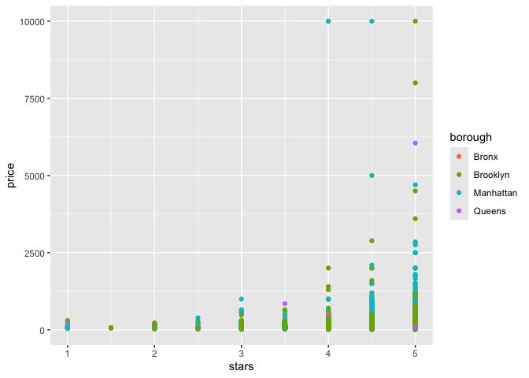
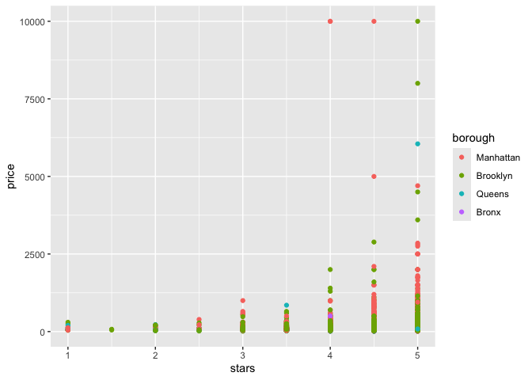

linear models
================

``` r
library(tidyverse)
```

    ## ── Attaching core tidyverse packages ──────────────────────── tidyverse 2.0.0 ──
    ## ✔ dplyr     1.1.4     ✔ readr     2.1.6
    ## ✔ forcats   1.0.1     ✔ stringr   1.6.0
    ## ✔ ggplot2   4.0.1     ✔ tibble    3.3.0
    ## ✔ lubridate 1.9.4     ✔ tidyr     1.3.1
    ## ✔ purrr     1.2.0     
    ## ── Conflicts ────────────────────────────────────────── tidyverse_conflicts() ──
    ## ✖ dplyr::filter() masks stats::filter()
    ## ✖ dplyr::lag()    masks stats::lag()
    ## ℹ Use the conflicted package (<http://conflicted.r-lib.org/>) to force all conflicts to become errors

``` r
library(p8105.datasets)
```

## import data

``` r
data("nyc_airbnb")

nyc_airbnb = 
  nyc_airbnb %>% 
  mutate(stars = review_scores_location / 2) %>% 
  rename(
    borough = neighbourhood_group,
    neighborhood = neighbourhood) %>% 
  filter(borough != "Staten Island") %>% 
  select(price, stars,borough, neighborhood, room_type)


data("nyc_airbnb")

nyc_airbnb = 
  nyc_airbnb |> 
  mutate(stars = review_scores_location / 2) |> 
  rename(
    borough = neighbourhood_group,
    neighborhood = neighbourhood) |> 
  filter(borough != "Staten Island") |> 
  select(price, stars, borough, neighborhood, room_type)
```

## fit a model

``` r
nyc_airbnb %>% 
  ggplot(aes(x = stars, y = price, color = borough)) + 
  geom_point()
```

    ## Warning: Removed 9962 rows containing missing values or values outside the scale range
    ## (`geom_point()`).

<!-- -->

Let’s fit the model

``` r
fit = lm(price ~ stars + borough, data = nyc_airbnb)
```

Let’s look at the results

Let’s look at the results better

``` r
broom::glance(fit)
```

    ## # A tibble: 1 × 12
    ##   r.squared adj.r.squared sigma statistic   p.value    df   logLik    AIC    BIC
    ##       <dbl>         <dbl> <dbl>     <dbl>     <dbl> <dbl>    <dbl>  <dbl>  <dbl>
    ## 1    0.0342        0.0341  182.      271. 6.73e-229     4 -202113. 4.04e5 4.04e5
    ## # ℹ 3 more variables: deviance <dbl>, df.residual <int>, nobs <int>

``` r
broom::tidy(fit) %>% 
  select(-std.error, statistic) %>% 
  mutate(
    term = str_replace(term, "borough", "Borough: ")
  ) %>% 
  knitr::kable(digits = 3)
```

| term               | estimate | statistic | p.value |
|:-------------------|---------:|----------:|--------:|
| (Intercept)        |  -70.414 |    -5.022 |   0.000 |
| stars              |   31.990 |    12.657 |   0.000 |
| Borough: Brooklyn  |   40.500 |     4.732 |   0.000 |
| Borough: Manhattan |   90.254 |    10.534 |   0.000 |
| Borough: Queens    |   13.206 |     1.457 |   0.145 |

## Be in control of factors

``` r
nyc_airbnb = 
  nyc_airbnb %>% 
  mutate(borough = fct_infreq(borough),
         room_type = fct_infreq(room_type)
  )
```

LOok at that plot again

``` r
nyc_airbnb %>% 
  ggplot(aes(x = stars, y = price, color = borough)) + 
  geom_point()
```

    ## Warning: Removed 9962 rows containing missing values or values outside the scale range
    ## (`geom_point()`).

<!-- -->

Refit model

``` r
fit = lm(price ~ stars + borough, data = nyc_airbnb)

broom::tidy(fit)
```

    ## # A tibble: 5 × 5
    ##   term            estimate std.error statistic   p.value
    ##   <chr>              <dbl>     <dbl>     <dbl>     <dbl>
    ## 1 (Intercept)         19.8     12.2       1.63 1.04e-  1
    ## 2 stars               32.0      2.53     12.7  1.27e- 36
    ## 3 boroughBrooklyn    -49.8      2.23    -22.3  6.32e-109
    ## 4 boroughQueens      -77.0      3.73    -20.7  2.58e- 94
    ## 5 boroughBronx       -90.3      8.57    -10.5  6.64e- 26

``` r
broom::glance(fit)
```

    ## # A tibble: 1 × 12
    ##   r.squared adj.r.squared sigma statistic   p.value    df   logLik    AIC    BIC
    ##       <dbl>         <dbl> <dbl>     <dbl>     <dbl> <dbl>    <dbl>  <dbl>  <dbl>
    ## 1    0.0342        0.0341  182.      271. 6.73e-229     4 -202113. 4.04e5 4.04e5
    ## # ℹ 3 more variables: deviance <dbl>, df.residual <int>, nobs <int>
